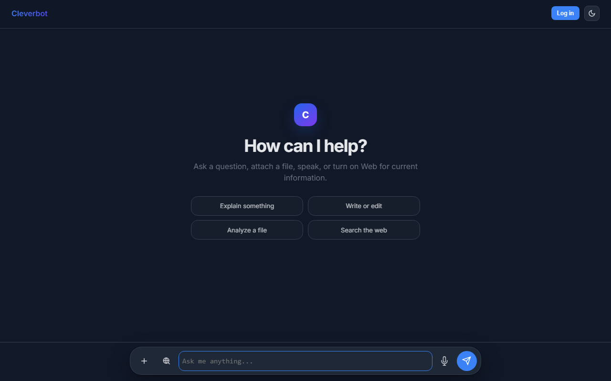

# Cleverbot

An AI chat assistant for the web and Android that streams answers from free OpenRouter models, with the API key kept on the server. Vite + React + TypeScript, Netlify functions, Convex for sign-in and chat history.

**Live:** [cleverbot.netlify.app](https://cleverbot.netlify.app)



## How it works

```
browser ── Convex Auth (password / anonymous) ──▶ Convex (*.convex.cloud / *.convex.site)
browser ──GET  /api/models──────▶ Netlify Function ──▶ OpenRouter /models
browser ──POST /api/chat────────▶ Netlify Function ──Bearer key──▶ OpenRouter
browser ◀────── SSE stream ──────────────────────────────────────
signed-in users also write threads/messages to Convex after each reply
```

- **Model choice is live.** `/api/models` fetches OpenRouter's current catalog, drops non-chat free models (embeddings, rerankers, classifiers) and ranks the rest for the task (chat, code, writing, vision). There is no hand-kept list.
- **Chat streams through a proxy.** `/api/chat` checks the request, adds the key and streams the reply back as server-sent events.
- **Replies render as Markdown** (marked + highlight.js), sanitized with DOMPurify before they reach the page. HTML files are offered for download only when you explicitly ask for one.
- **Guests can chat; signed-in users keep history.** Sign-in is email + password or anonymous (Convex Auth). Threads and messages are stored in Convex.
- **Android** is the same web app wrapped with Capacitor (`android/`).

## Decisions

- **The API key never reaches the browser.** It lives only in the Netlify function. The function accepts only `:free` models and caps message count, message size, total size and image size, so the endpoint can't be used to run paid models or send huge payloads.
- **Web search only when it's needed.** OpenRouter's web plugin costs credits even with a free model, so it is attached only when the latest message asks for a search or needs current facts (news, weather, "today", …), or when you turn it on yourself.
- **No long-lived cloud keys for Android releases.** The release workflow signs in to Google Cloud with Workload Identity Federation, and the signing keystore and `google-services.json` come from GitHub secrets; neither file is committed.

## Tests and running locally

```bash
npm install
npm test                     # 57 tests (node:test + tsx), no network or keys needed
```

To run the app you need your own Convex project and OpenRouter key (see Configuration):

```bash
cp .env.example .env.local   # add VITE_CONVEX_URL after convex dev
echo 'OPENROUTER_API_KEY=sk-or-...' > .env

npx convex dev               # terminal 1: auth + database
npm start                    # terminal 2: netlify dev (Vite + /api/*)
# or: npm run dev            # Vite only (chat APIs need the Netlify proxy)
```

Production build (a dummy Convex URL is enough to compile):

```bash
VITE_CONVEX_URL=https://placeholder.convex.cloud npm run build
```

## Guest vs signed-in

| | Guest | Signed in (password or anonymous) |
|---|---|---|
| Chat via Netlify `/api/chat` (streaming) | Yes | Yes |
| Web search (OpenRouter `web` plugin) | Yes (server-side) | Yes (server-side) |
| Left sidebar history | Prompt to sign in; not saved | Threads + messages in Convex |
| New chat | Clears local session | Clears selection; creates thread on first send |

## Configuration

### 1. Convex project

1. Create a project at [dashboard.convex.dev](https://dashboard.convex.dev)
2. In this repo: `npx convex dev` (links the project, writes `.env.local` with `VITE_CONVEX_URL`, generates `_generated`)
3. Deploy the backend: `npx convex deploy`

### 2. Convex dashboard env vars

| Variable | Where | Notes |
|---|---|---|
| `SITE_URL` | Convex env | Frontend origin, e.g. `https://cleverbot.netlify.app` |
| `JWT_PRIVATE_KEY` | Convex env | From `npx @convex-dev/auth` |
| `JWKS` | Convex env | Generated with the JWT key |

No Google/GitHub OAuth client is required.

### 3. Netlify / Vite env

| Variable | Where | Notes |
|---|---|---|
| `VITE_CONVEX_URL` | Netlify + local `.env.local` | `https://<deployment>.convex.cloud` |
| `OPENROUTER_API_KEY` | Netlify + local `.env` | Server-side only (`sk-or-...`) |

Do **not** put `OPENROUTER_API_KEY` in Convex or any `VITE_*` client variable. **Never commit real secrets.**

## Deploy

1. `npx convex deploy`
2. Set Netlify env: `VITE_CONVEX_URL`, `OPENROUTER_API_KEY`
3. Push / redeploy on Netlify (`npm run build` → `dist/`, functions unchanged)

## Android app and release workflow

The web app ships as an installable Android app through **Capacitor**. Releases are built by a manually triggered GitHub Actions workflow (`.github/workflows/firebase-distribute.yml`) that:

1. runs the unit tests and the TypeScript build,
2. signs in to Google Cloud with **Workload Identity Federation** (no long-lived service-account key stored anywhere),
3. restores the signing keystore and `google-services.json` from GitHub secrets,
4. builds and verifies a signed release APK, and
5. distributes it privately to a Firebase App Distribution tester group.

**Status (2 Oct 2026):** the workflow is written but has not run yet. It needs the `android-production` environment, the Workload Identity and Firebase variables, and the signing secrets set on the repo first (see `docs/ANDROID_RELEASE_RECOVERY.md`).

## Project structure

```
index.html                 Vite HTML shell
src/
  main.tsx                 ConvexAuthProvider + app bootstrap
  App.tsx                  Sidebar + chat layout
  components/              Chat UI, auth button, theme toggle
  lib/api.ts               /api/chat SSE client
  lib/config.ts            Endpoints and offline fallback model (no secrets)
  css/styles.css
convex/
  schema.ts                authTables + threads + messages
  auth.ts                  Convex Auth (password + anonymous)
  http.ts                  Auth HTTP routes
  threads.ts / messages.ts Auth-gated queries & mutations
  users.ts                 Current user (viewer)
netlify/functions/         OpenRouter proxy and model ranking (key stays here)
test/                      node:test (+ tsx for TS libs)
```

## Security

- API key is server-side only (`netlify/functions/chat.mjs`)
- Free-model allowlist and payload size limits on the chat proxy
- Model output sanitized with DOMPurify before `innerHTML`
- CSP allows Convex (`*.convex.cloud`, `*.convex.site`) for auth/sync

## License

MIT
